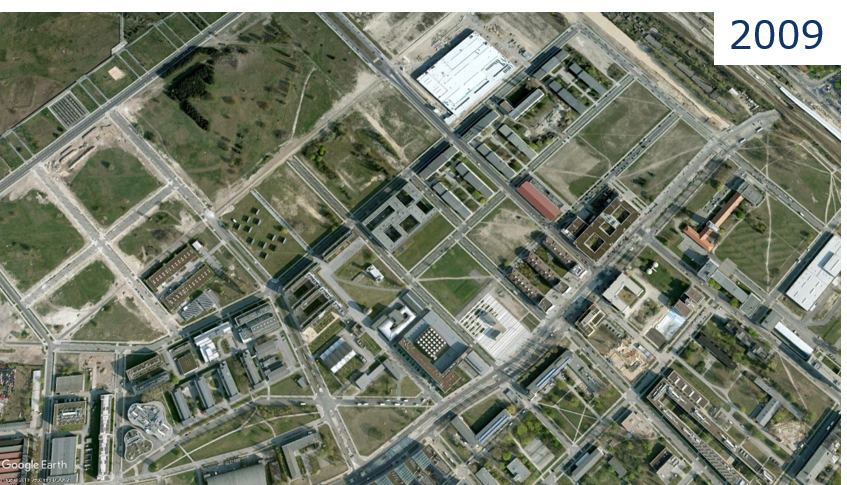
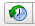

 

```{r knitr_init, echo=FALSE, cache=FALSE, message=FALSE, include=FALSE}
library(knitr)
library(rmdformats)
library(shiny)

## Global options
options(max.print='75')
opts_chunk$set(echo=FALSE,
	             cache=TRUE,
               prompt=FALSE,
               tidy=FALSE,
               comment=NA,
               message=FALSE,
               warning=FALSE, 
               use_bookdown = TRUE)
opts_knit$set(width=75)
```

# Welcome!


## About

Introduction to Remote Sensing is an introductory remote sensing course for Geography students at Humboldt-Universität zu Berlin. In this course, you will be exposed to theoretical fundaments and introductory applications of remote sensing. The course is based on open source software.

------

## Requirements 

------

## Learning goals & course contents

------

# Course materials

## Software 

We use openly available and platform independent (Windows, Linux, Mac OS) software packages throughout this course. Please install the latest versions of: 

* [R v3.6.X](https://www.r-project.org/)
* [R studio v1.2.X](https://rstudio.com/products/rstudio/)
* [QGIS v3.1X.X](https://www.qgis.org/)


------

## Data

------

## Assignments

The weekly assignments are defined in the respective session. Each session comprises several tasks that involve scipting in R. Course participants must submit completed assignments, documented as R scripts, in [moodle](http://moodle.hu-berlin.de/) to pass. Weekly submission deadlines are monday, 23:59. Please name the script of your work group as SXX_name1_name2.R. Please structure your script for every assignment as follows:

------

# Visual image interpretation

 


## Image interpretation

* Open Google Earth^TM^

* Deactivate the oblique view (use key "R")

* Disable multimedia (e.g. pictures)

* Move to two different positions in Berlin and answer the following questions with help of the aerial photographs:

    + Which season was the flight operated in?

    + Is it possible to get the exact month and/or day?

    + What was the day of the week?

    + What was the time of day?

## Digitizing

* Navigate to Campus Adlershof

* Right-click on 'Meine Orte' and create a new folder called 'FE1'

* Use the digitizing tools (see image below) to...

    + Mark the wind tunnel as a point
    
    + Digitize a section of the S-Bahn trail as a line
    
    + Save the Institute of Geography as a polygon (semitransparent and outlined)
    
* The results of the digitization need to be located in the 'FE1' folder

* Save the folder 'FE1' with a right-click on the folder as a .kmz file on O:/...

    

## Observing change

* Use the date tool (see image below) to observe older/historical photos of Adlershof and answer the following questions:

    + What is the frequency of photo observations before and after 2010?
    
    + What major changes can be detected in Adlershof in 2000, 2010 and 2019?
    
    + Do your polygons/lines/points fit older pictures as well?
    
    + Describe the differences of image data in 1953, 2000 and 2019. Why do they differ?
    
    

## Summary

* The analysis of earth observation data (satellite and aerial images) allows us to draw a variety of conclusions about processes and conditions of the Earth's surface. For such analysis, different image properties are used (object features and context).

* With help of image data from different dates, changes of the Earth's surface can be analyzed.

* The quality of image data enhanced over time. Today, satellite images with a spatial resolution of less than 1 m are available for most parts of the earth, in urban agglomerations aerial photographs often even exceed 10 cm spatial resolution.

## Exercise

Characterize the land cover and land use change in Berlin with Google Earth^TM^.

* On O:/WS2021_FE1/S01 you find a .kmz file with two given areas (Berlin-Mitte and Berlin-Adlershof)

* Choose three suitable objects within each area and outline them with the digitizing tools

* Choose three time steps (depending on the available data) that show a change process for your chosen objects

* Answer the following questions for your objects (with images and text):

    + What changes contentwise?
    
    + What changes concretely in the photos?
    
*Upload your results as a PDF file on Moodle (each participant separately).*

------

# On-screen visualization

## Recap

* We can describe the human eye as a 'sensor with three bands'

* Sensitive for electromagnetic radiation (EMR) in the blue, green and red regions: **spectral range** between ~400-700 nm

* The receptors for the three colors are stimulated across wavelength regions of ~150-200 nm (**spectral resolution**)

* The intervals between the wavelengths of maximum sensitivity are ~50 nm to 150 nm wide (**spectral sampling interval**) 


)](docs/fig/retinal response.png)

* Digital cameras correspond to imaging sensors with three bands


* Spectrometers are sensitive to wavelengths beyond the human eye’s sensitivity

* **Optical remote sensing** makes use of the visible light (~380 - 700 nm), and the near and short-wave infrared (0.7 - ~3 µm)

* **Thermal remote sensing**  detects thermal infrared radiation (5 - 15 µm)

* **Radar remote sensing** detects microwave radiation (1 mm - 1 m)

* Common abbrevations:

    + VIS = visible: 380 - 700 nm
    
    + nIR = near infrared: 0.7 - 1.3 µm
    
    + swIR = short wave infrared: 1.3 - 3 µm
    
    + tIR = thermal infrared: 5 - 15 µm
    
)](docs/fig/wavelength regions.jpg)

* Optical remote sensing sensors make it possible to take images in the visible light (VIS), near-infrared (nIR) and shortwave-infrared (swIR)


## Additive color model

* Primary colours: red, green and blue (RGB)

* Values range from 0 to 255 (the higher the more intense)

* Max. 256 * 256 * 256 = 16,7 mio colours

* Complementary/secondary colours: cyan, magenta and yellow (CMY)

, source right: [informatikzentrale.de](http://www.informatikzentrale.de ))](docs/fig/RGB Farbmodell.png)

### Exercise for colour mixing in QGIS

* Open the shapefile 'charlottenburg_point.shp' in a new QGIS-project

* Open the 'Select Color Tool' of the shapefile (Properties > Symbology > double click on colour bar)
    
* For displaying different colours QGIS offers the RGB and HSV colour model


* Enter the colour values of the following table in the QGIS colour model and note/describe the resulting colour

    | red | green | blue | colour |
    | :---: | :---: | :---: | :---: |
    | 255 | 0 | 0 |                |
    | 255 | 0 | 255 |                |
    | 0 | 255 | 255 |                |
    | 255 | 255 | 0 |                |
    | 0 | 0 | 0 |                |
    | 25 | 25 | 25 |                |
    | 150 | 150 | 150 |                |
    | 255 | 255 | 255 |                |

## Screen representation of remote sensing images

* Remote sensing images can be presented as a greyscale image (single band) or RGB-composite (combination of three different bands)


## Image histogram

* Image histograms show the frequency distribution of pixel values i.e. of a single band


### Contrast stretch

* Every RGB-channel has a colour depth of 8-bit on a monitor (equivalent to 256 greyscales)

* Transfer of pixel values of an image (or band) to a monitor initially 1:1

* At best, full grey value range is utilized optimally


* Due to recording and sensor conditions, data sets (or bands) often display only a section of the 256 obtainable grey values

* With a 1:1 transfer, images are often low-contrast


* "Stretching" the image histogram, the screen display can be enhanced

* Caution! The screen display changes, the data stays the same!


* Contrast enhancement describes a function of representation that is used to transfer pixel values in grey values

* Often, linear contrast enhancement is used where the increase in gray value per increase in pixel value remains the same for the relevant value ranges


## Exercise

* Open the Sentinel-2 image '20150704_LEVEL2_SEN2A_BOA_berlin.bsq' in QGIS

* The image has a spatial resolution of 10 m, an extent of 2700 x 2700 pixel and 4 spectral bands (B1 = blue, B2 = green, B3 = red, B4 = nIR) 

* Open the display options of the image (Symbology)

* What are the default settings after loading the image:

    + render type
    
    + RGB assignment
    
    + min/max value settings
    


* Display the Sentinel-2 image in true colours


* Now, display only band 1 (blue) in greyscale (Render type > Singleband grey)

    + How did the min/max value settings change?
    
    + How rich in contrast does the image appear?
    
    + How does the image representation change when you alter the min/max value settings (i.e. cumulative count cut, etc.)?
    
1. Switch to the histogram section and calculate the image histogram

2. Adjust the settings as shown in the picture below

3. Select the nIR band

4. Vary the settings for min/max values to alter the contrast manually

5. Try to differentiate water bodies from land mass by stretching the min/max values


1. Create a true and false colour (R = nIR, G = red, B = green) representation of the Sentinel 2 image and describe the main differences (key words)

2. Find one example (Screenshot) for each of the following surfaces with the true and false colour representation:

    + Deciduous forest
    
    + Coniferous forest
    
    + Artificial turf pitch
    
    + True turf pitch
    
3. Subsequently, describe the differences between deciduous and coniferous forest and artificial and true turf

4. For what phenomenons and/or surfaces is the nIR channel particularly sensitive?

*Summarize task 1 - 4 visually and textually and upload your results as a PDF file on Moodle.*

------

# Land cover / land use classification

## Mapping the Earth's surface

* The Earth's surface is a mosaic of various landscapes (natural, semi-natural and anthropogenic)

* Mapping with remote sensing requires generalized/transferable classification schemes to describe the Earth's surface


## Land cover or land use? 

* What does a satellite see from orbit?


* Land **cover**:

    + Biophysical cover of the Earth's surface
    
    + For instance crops, forest, build-up area


* Land **use**:

    + Anthropogenic use of the Earth's surface
    
    + For instance agriculture, forestry, residential area
    


## Visual image interpretation

| factor | explanation | example |
| :----- | :--------- | :------ |
| contrast, colour, brightness | depend on reflective properties of the recorded surfaces | depth of water, roof material |
| shape and size | geometry, outlines and edges that divide the landscape in different objects | airport, river course |
| texture | structure of a surface due to material or surface properties, strongly depends on scale | maize cultivation, fields, forest |
| spatial context | determines functional interrelationship i.e. building function | railway station, lido, farm |
| shadows | contain information on object form, height and function | wind turbine, landscape topography |


## Land use / cover area frame survey (LUCAS)

* Sample survey for land use and land cover in the EU

    + Collection of data on land use and land cover (LULC) as well as temporal changes
    
    + In situ gathering of point data by a standardized classification scheme to ensure comparability between EU member states
    
* Used in the context of

    + Agriculture policy i.e. common agriculture policy
    
    + Conservation i.e. EU biodiversity strategy
    
    + Environmental monitoring i.e. COPERNICUS
    
* [**Further information on LUCAS**](https://ec.europa.eu/eurostat/statistics-explained/index.php/LUCAS_-_Land_use_and_land_cover_survey)

* LUCAS points are based on a 2-km-raster (ca. 1,1 mio points) from which around 270,000 were extracted for the survey

* Survey takes place every three years (last 2018) involving ca. 750 cartographers

)](docs/fig/LUCAS 1.png)


* LUCAS as reference for remote sensing analyses i.e. europe-wide classification of land cover (Pflugmacher et. al 2018)

)](docs/fig/LUCAS 3.png)

### LUCAS classification scheme


## Exercise

**Part 1: Development of a classification scheme based on LUCAS nomenclature**

* Open the false-colour satellite image of Wuhlheide (1990) on O:/ in QGIS

  

*  Create a classification scheme for the following nine surface types: 

    + Buildings
    + Streets
    + Rails
    + Sealed (non-build-up) areas
    + Coniferous forest
    + Deciduous forest
    + Mixed forest
    + Grassland
    + Water
  
  
* Add a sample image and a short description (class properties) for every class

* Further, add the LUCAS land use and land cover class. Use the most detailed level! (See *LUCAS2015_C1_Annex_Classification_sheme.pdf*)


**Part 2: Mapping of your example areas**

* Digitize your example areas in QGIS according to your classification scheme from task 1. Note the following:

    + Three example areas for each class
    
    + Minimum mapping unit equals 0.05 ha (500 m^2^), objects smaller than that are included in the surrounding class
    
* Create a map with your results and add a legend

* Note and discuss problems and inaccuracies (key words)

*Upload the classififation scheme, map with legend and your discussion as a PDF file on Moodle.*

------

# Lab and field spectroscopy

## [USGS spectral characteristics viewer](https://landsat.usgs.gov/spectral-characteristics-viewer)

## 

------

# Optical data (Multi- / Hyperspectral)

## Raster formats

## Metadata

## HyMap data

------

# EnMAP Box for QGIS

## Introduction

## Installation

## Key features

## Demo

------

# Data acquisition

## Provider (vielleicht eher 'Sentinel 2'?)

* COPERNICUS program features a pair of optical Earth observing satellites: Sentinel-2A and -2B
Launched in June 2015  (Sentinel-2A), and March 2017 (Sentinel-2B)

* Revisit time 5 days with both satellites, 290km swath width

* Sensor: Multispectral Imager (MSI), 13 spectral bands, partly resembling Landsat

* Spatial resolution of 10 – 60 m, depending on spectral bands, e.g. nIR bands 8 (10m) and 8a (20m).


## Sentinel 2
* Sentinel-2 products are delivered in various processing levels. 

   * Level 1B: Top-of-atmosphere radiance values in sensor geometry 

   * Level 1C: Top-of-atmosphere reflectance in cartographic geometry 

   * Level 2A: Bottom-of-atmosphere reflectance in cartographic geometry

* L1C and L2A products are partitioned in “granules”: 100x100 km2 UTM/WGS84 projection


## Acquiring Sentinel-2 data
* Create a User-Account at the [Copernicus Open Access Hub](https://scihub.copernicus.eu/dhus/#/home)
* Search for images with these specifications: 


      Date: XXX

      Sensor: Sentinel-2

      Producttype: Surface Reflectance (Level 2A, S2MSI2A) 

      Cloud cover: max. 20%

      Region: greater area of Berlin

* How many images are available for these specifications?
download this image: 

Granule: XXX

Date: XXX

## Pre-processing
* The downloaded Sentinel-2 image is a .zip-file

* Unzip it and delete the .zip-file

* Take a look at your files


### Visualizing the Sentinel-2 image with 'Virtual Raster Builder' in the EnMAP-Box 
* Goal: the single bands in JPEG2000-format (.jp2) will be merged into a single Multiband-Image in ENVI-format

* Open QGIS and install the 'Virtual Raster Builder' plugin 

* Open the EnMAP-Box and load 'S2_Subset_Berlin.shp' into Data Sources. The shapefile will be used to clip the Sentinel-2 scene to a smaller extend 

* Open 'Virtual Raster Builder' from the EnMAP-Box. Create a Multiband-Image with the following specifications: 
  - Spectral Bands: B2, B3, B4, B5, B6, B7, B8a, B11, B12
  - Spatial Resolution: 20m (from the 'R20M' file)
  - Spatial Extend: according to the shapefile
  - Format: ENVI 

### Create VRT (in den Folien vom Vorjahr soll man ein ENVI erstellen...)

### Amend metadata
* Visualize the Multiband Sentinel-2 Image in the EnMAP-Box with the band combination R = 8a (nIR), G = 4 (red), B = 3 (green).

* Take a look at the .hdr file. Which metainformation is missing ?

* Delete the edited Sentinel-2 image from the Data Source Panel. Also delete the .aux-file and .vrt-file from apple finder / windows explorer 

* Add the wavelengths of the single bands and the unit for the wavelengths in the .hdr file (metadata). Research the unit and the extend of the applied Sentinel-2 wavelengths.  

* Reload the Sentinel-2 image into the Data Source Panel. The wavelengths should now be displayed on the x-axis when visualizing at image spectra. Now you can compare spectra from different Sensors. 


### Compare S2 & HyMap
part 1 - spatial resolution 

* Visualize the Sentinel-2 image and the HyMap image from last week in a RGB bandcombination that is suited for comparison. In order to do that open the images in two separate MapViews and link them (spatialy + zoom)

* Compare both images visually and describe the effects on image details due to the different spatial resolution (20 m vs. 3.6 m). 

* Choose one surface as example for each of these classes: impervious- build up, impervious- not build up, grass/lawn, trees, soil, water. 

* Take a screenshot from each example. 

### Compare S2 & HyMap
part 2 - spectral resolution

* Restart QGIS and EnMAP-Box. Display the Sentinel-2 image and the HyMap image in a suited RGB band combination (Wozu ist der Neustart notwendig ?)

* Visualize spectra of the same surface in the Sentinel-2 and in the HyMAP image (9 vs. 111 spectral bands). 

* Try to choose a 'pure' surface (no mixtures) which is also stable in temporal terms (unchanged over time). 

* Do this for the classes mentioned above and add a description and a screenshot. 

* **Assignment:** please upload the comparison (spatial and spectral) of the Sentinel-2 and the HyMap image as pdf to moodle.  

 

------

# Vegetation properties & spectral indices


## Normalized Difference Vegetation Index (NDVI)

* The derivation of vegetation indicies or similar variables is based on feature extraction 

* NDVI the one of the most common vegeation indicies 

* It represents the difference between red and nIR reflectance. This difference is strongly prounounced with photosynthetically active vegetation.  (Sollte man wahrscheinlich nochmal umschreiben)

* The NDVI displayes this difference within a normalized value (between -1 and 1) for each pixel.
 
$$NDVI = (ρnIR- ρred) / (ρnIR+ ρred)$$

* e.g. for Sentinel-2 data use reflectance from bands nIR = 865 nm and red = 665 nm for calculating the NDVI.
 
* The calculation of the NDVI results in a singleband grayscale image which can be saved as a new file.  

## Part 1: Calculating the Normalized Difference Vegetation Index (NDVI) for Sentinel-2 data 

* Open the EnMAP-Box and display the Sentinel-2 image (20 m, 9 spectral bands, subset Berlin, DATE: XXX) from last week in a RGB bandcombination of your choice. 

* via 'Applications' start the 'imageMath Calculator' and calculate the NDVI. 

      1. specify the the input image    -> S2_20m = [select Sentinel-2 image]
      
      2. define bands nIR [865 nm] and  -> red    = float32(S2_20m[2])
         red [665 nm] as variable       -> nIR    = float32(S2_20m[6])  
         
      3. provide the NDVI formular      -> NDVI   = (nIR - red)/(nIR + red)
      
      4. specify the output image       -> NDVI   = [filepath and name of the NDVI image]

    
* Run the function and open the singleband grayscale image in a new Map View 

## Part 2: Discussion of the NDVI 

* Take a look at the NDVI-Pixelvalues and create a NDVI image-histogram (Tools 'ImageStatistics') 


* Which value range take pixels in the NDVI image ? 

* Note a representative NDVI value for these surfaces: water, asphalt, decidous forest, open soil. 

* Also, note the corresponding refectance values in the red and nIR band from the original image. How can the values be explained, concerning the spectral properties of the surfaces? 

* Under what cirumstances (relation red to nIR) can NDVI values of 0; 1; -1 be created (in theory)? Please note one pair of values (red and nIR) for each of these NDVI values. 

## part 3: Visualizing of NDVI classes 

* classify the NDVI image through the style menu within the layer properties. Try to display three surfaces: water, impervious/soil and vegetation. 


## Assignment part 1: Correlation of NDVI and Imperviousness  

* Open the image 'copernius_imperviousness_2015_berlin.bsq' in a second Map Window and link it to the NDVI image. 

* Inform yourself about the origin of the layer: (https://land.copernicus.eu/pan-european/high-resolution-layers/imperviousness)

* Gather NDVI values of 20 surfaces (zu viele, 10 würden reichen) in a table. Make sure to cover a wide range of values (e.g. -0.2 to 1).

* Create a scatterplot that shows the correlation between NDVI and imperviousness. Use a software of your choice; prefarably R. 

* Describe and discuss the scatterplot in bullitpoints. 

## Assignment part 2: Temporal Variation of the NDVI

* Calculate another NDVI image from the provided Sentinel-2 image taken in winter (date XXX). Use the 'imageMath Calculator'. 

    -> Sentinel_2_T33UUU_20190216_20m_9bands_subset_berlin.bsq  

* Then calculate a difference-image for summer and winter NDVI.

    -> NDVI 27. Juli 2019 – NDVI 16. Februar 2019  DATES: XXX
    
* Create the histogram of the difference-image and briefly discuss the distribution   

* Display the difference-image in a suited Visualisation; e.g. discrete classes, colour gradient from high negative to high positive differences. 

* Discuss the resulting Map in bullitpoints concerning these surfaces: impervious (buildings, and non build-up), agriculture, forest, water. 
* **Assignment:** Please upload the results of the comparison of NDVI and imperviousness (part 1, plot and discussion) and the temporal variation of NDVI (part 2, histogram, map + legend, discussion) as pdf to moodle.

Berechnen Sie das Histogramm des NDVI-Differenzbildes und diskutieren Sie die Verteilung stichpunktartig.

Stellen Sie das NDVI-Differenzbild mit einer sinnvollen Visualisierung dar, z.B. einer diskrete Klassenunterteilung, oder einem Farbgradienten von hohen negativen bis zu hohen positiven Differenzen. 
Diskutieren Sie die Karte stichpunktartig bzgl. folgender Oberflächen: Versiegelte Flächen (Gebäude & unbebaut), Landwirtschaft, Wald, Wasser
Bitte laden Sie die Ergebnisse des Vergleiches NDVI und Versieglung (Teil 1, Plot, Diskussion) und der temporalen Variation des NDVI (Teil 2; Histogramm, Karte + Legende, Diskussion) als PDF in Moodle hoch.


------

# Image classification

------

# Random forest

------

# Accuracy assessment

------

# Sentinel-2 time series

------

# MODIS time series

------

# Case studies: Change detection

------

