 

```{r knitr_init, echo=FALSE, cache=FALSE, message=FALSE, include=FALSE}
library(knitr)
library(rmdformats)
library(shiny)

## Global options
options(max.print='75')
opts_chunk$set(echo=FALSE,
	             cache=TRUE,
               prompt=FALSE,
               tidy=FALSE,
               comment=NA,
               message=FALSE,
               warning=FALSE, 
               use_bookdown = TRUE)
opts_knit$set(width=75)
```

# Welcome!


## About

Introduction to Remote Sensing is an introductory remote sensing course for Geography students at Humboldt-Universität zu Berlin. In this course, you will be exposed to theoretical fundaments and introductory applications of remote sensing. The course is based on open source software.

------

## Requirements 

------

## Learning goals & course contents

------

# Course materials

## Software 

We use openly available and platform independent (Windows, Linux, Mac OS) software packages throughout this course. Please install the latest versions of: 

* [R v3.6.X](https://www.r-project.org/)
* [R studio v1.2.X](https://rstudio.com/products/rstudio/)
* [QGIS v3.1X.X](https://www.qgis.org/)


------

## Data

------

## Assignments

The weekly assignments are defined in the respective session. Each session comprises several tasks that involve scipting in R. Course participants must submit completed assignments, documented as R scripts, in [moodle](http://moodle.hu-berlin.de/) to pass. Weekly submission deadlines are monday, 23:59. Please name the script of your work group as SXX_name1_name2.R. Please structure your script for every assignment as follows:

------

# Visual image interpretation

 

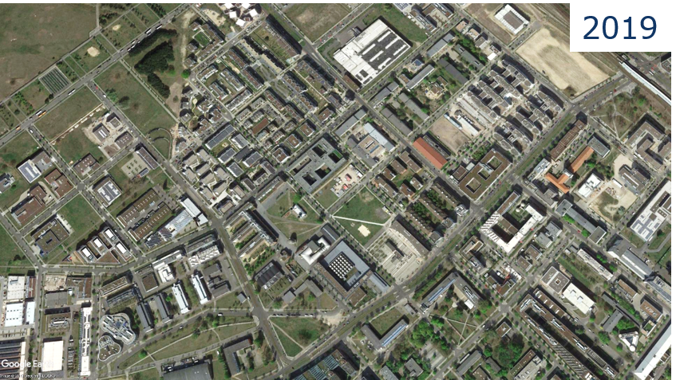

## Image interpretation

* Open Google Earth^TM^

* Deactivate the oblique view (use key "R")

* Disable multimedia (e.g. pictures)

* Move to two different positions in Berlin and answer the following questions with help of the aerial photographs:

    + Which season was the flight operated in?

    + Is it possible to get the exact month and/or day?

    + What was the day of the week?

    + What was the time of day?

## Digitizing

* Navigate to Campus Adlershof

* Right-click on 'Meine Orte' and create a new folder called 'FE1'

* Use the digitizing tools (see image below) to...

    + Mark the wind tunnel as a point
    
    + Digitize a section of the S-Bahn trail as a line
    
    + Save the Institute of Geography as a polygon (semitransparent and outlined)
    
* The results of the digitization need to be located in the 'FE1' folder

* Save the folder 'FE1' with a right-click on the folder as a .kmz file on O:/...

    

## Observing change

* Use the date tool (see image below) to observe older/historical photos of Adlershof and answer the following questions:

    + What is the frequency of photo observations before and after 2010?
    
    + What major changes can be detected in Adlershof in 2000, 2010 and 2019?
    
    + Do your polygons/lines/points fit older pictures as well?
    
    + Describe the differences of image data in 1953, 2000 and 2019. Why do they differ?
    
    

## Summary

* The analysis of earth observation data (satellite and aerial images) allows us to draw a variety of conclusions about processes and conditions of the Earth's surface. For such analysis, different image properties are used (object features and context).

* With help of image data from different dates, changes of the Earth's surface can be analyzed.

* The quality of image data enhanced over time. Today, satellite images with a spatial resolution of less than 1 m are available for most parts of the earth, in urban agglomerations aerial photographs often even exceed 10 cm spatial resolution.

## Exercise

Characterize the land cover and land use change in Berlin with Google Earth^TM^.

* On O:/WS2021_FE1/S01 you find a .kmz file with two given areas (Berlin-Mitte and Berlin-Adlershof)

* Choose three suitable objects within each area and outline them with the digitizing tools

* Choose three time steps (depending on the available data) that show a change process for your chosen objects

* Answer the following questions for your objects (with images and text):

    + What changes contentwise?
    
    + What changes concretely in the photos?
    
* **Assignment:** Upload your results as a PDF file on Moodle (each participant separately).

------

# On-screen visualization

## Recap

* We can describe the human eye as a 'sensor with three bands'

* Sensitive for electromagnetic radiation (EMR) in the blue, green and red regions: **spectral range** between ~400-700 nm

* The receptors for the three colors are stimulated across wavelength regions of ~150-200 nm (**spectral resolution**)

* The intervals between the wavelengths of maximum sensitivity are ~50 nm to 150 nm wide (**spectral sampling interval**) 


)](docs/fig/retinal response.png)

* Digital cameras correspond to imaging sensors with three bands


* Spectrometers are sensitive to wavelengths beyond the human eye’s sensitivity

* **Optical remote sensing** makes use of the visible light (~380 - 700 nm), and the near and short-wave infrared (0.7 - ~3 µm)

* **Thermal remote sensing**  detects thermal infrared radiation (5 - 15 µm)

* **Radar remote sensing** detects microwave radiation (1 mm - 1 m)

* Common abbrevations:

    + VIS = visible: 380 - 700 nm
    
    + nIR = near infrared: 0.7 - 1.3 µm
    
    + swIR = short wave infrared: 1.3 - 3 µm
    
    + tIR = thermal infrared: 5 - 15 µm
    
)](docs/fig/wavelength regions.jpg)

* Optical remote sensing sensors make it possible to take images in the visible light (VIS), near-infrared (nIR) and shortwave-infrared (swIR)


## Additive color model

* Primary colours: red, green and blue (RGB)

* Values range from 0 to 255 (the higher the more intense)

* Max. 256 * 256 * 256 = 16,7 mio colours

* Complementary/secondary colours: cyan, magenta and yellow (CMY)

, source right: [informatikzentrale.de](http://www.informatikzentrale.de ))](docs/fig/RGB Farbmodell.png)

### Exercise for colour mixing in QGIS

* Open the shapefile 'charlottenburg_point.shp' in a new QGIS-project

* Open the 'Select Color Tool' of the shapefile (Properties > Symbology > double click on colour bar)
    
* For displaying different colours QGIS offers the RGB and HSV colour model


* Enter the colour values of the following table in the QGIS colour model and note/describe the resulting colour

    | red | green | blue | colour |
    | :---: | :---: | :---: | :---: |
    | 255 | 0 | 0 |                |
    | 255 | 0 | 255 |                |
    | 0 | 255 | 255 |                |
    | 255 | 255 | 0 |                |
    | 0 | 0 | 0 |                |
    | 25 | 25 | 25 |                |
    | 150 | 150 | 150 |                |
    | 255 | 255 | 255 |                |

## Screen representation of remote sensing images

* Remote sensing images can be presented as a greyscale image (single band) or RGB-composite (combination of three different bands)


## Image histogram

* Image histograms show the frequency distribution of pixel values i.e. of a single band


### Contrast stretch

* Every RGB-channel has a colour depth of 8-bit on a monitor (equivalent to 256 greyscales)

* Transfer of pixel values of an image (or band) to a monitor initially 1:1

* At best, full grey value range is utilized optimally


* Due to recording and sensor conditions, data sets (or bands) often display only a section of the 256 obtainable grey values

* With a 1:1 transfer, images are often low-contrast


* "Stretching" the image histogram, the screen display can be enhanced

* Caution! The screen display changes, the data stays the same!


* Contrast enhancement describes a function of representation that is used to transfer pixel values in grey values

* Often, linear contrast enhancement is used where the increase in gray value per increase in pixel value remains the same for the relevant value ranges


## Exercise

* Open the Sentinel-2 image '20150704_LEVEL2_SEN2A_BOA_berlin.bsq' in QGIS

* The image has a spatial resolution of 10 m, an extent of 2700 x 2700 pixel and 4 spectral bands (B1 = blue, B2 = green, B3 = red, B4 = nIR) 

* Open the display options of the image (Symbology)

* What are the default settings after loading the image:

    + render type
    
    + RGB assignment
    
    + min/max value settings
    


* Display the Sentinel-2 image in true colours


* Now, display only band 1 (blue) in greyscale (Render type > Singleband grey)

    + How did the min/max value settings change?
    
    + How rich in contrast does the image appear?
    
    + How does the image representation change when you alter the min/max value settings (i.e. cumulative count cut, etc.)?
    
1. Switch to the histogram section and calculate the image histogram

2. Adjust the settings as shown in the picture below

3. Select the nIR band

4. Vary the settings for min/max values to alter the contrast manually

5. Try to differentiate water bodies from land mass by stretching the min/max values


1. Create a true and false colour (R = nIR, G = red, B = green) representation of the Sentinel 2 image and describe the main differences (key words)

2. Find one example (Screenshot) for each of the following surfaces with the true and false colour representation:

    + Deciduous forest
    
    + Coniferous forest
    
    + Artificial turf pitch
    
    + True turf pitch
    
3. Subsequently, describe the differences between deciduous and coniferous forest and artificial and true turf

4. For what phenomenons and/or surfaces is the nIR channel particularly sensitive?

* **Assignment:** Summarize task 1 - 4 visually and textually and upload your results as a PDF file on Moodle.

------

# Land cover / land use classification

## Mapping the Earth's surface

* The Earth's surface is a mosaic of various landscapes (natural, semi-natural and anthropogenic)

* Mapping with remote sensing requires generalized/transferable classification schemes to describe the Earth's surface

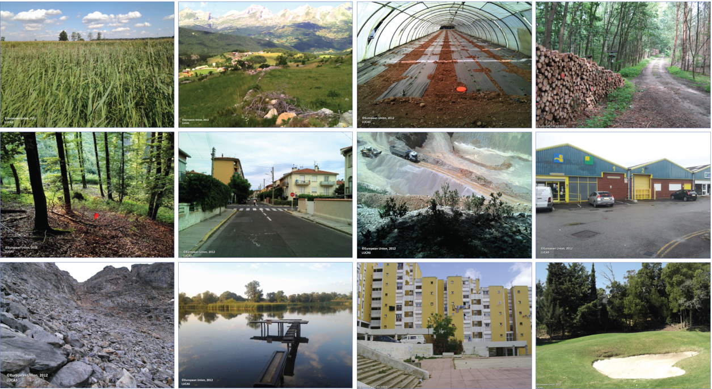

## Land cover or land use? 

* What does a satellite see from orbit?


* Land **cover**:

    + Biophysical cover of the Earth's surface
    
    + For instance crops, forest, built-up area


* Land **use**:

    + Anthropogenic use of the Earth's surface
    
    + For instance agriculture, forestry, residential area
    


## Visual image interpretation

| factor | explanation | example |
| :----- | :--------- | :------ |
| contrast, colour, brightness | depend on reflective properties of the recorded surfaces | depth of water, roof material |
| shape and size | geometry, outlines and edges that divide the landscape in different objects | airport, river course |
| texture | structure of a surface due to material or surface properties, strongly depends on scale | maize cultivation, fields, forest |
| spatial context | determines functional interrelationship i.e. building function | railway station, lido, farm |
| shadows | contain information on object form, height and function | wind turbine, landscape topography |


## Land use / cover area frame survey (LUCAS)

* Sample survey for land use and land cover in the EU

    + Collection of data on land use and land cover (LULC) as well as temporal changes
    
    + In situ gathering of point data by a standardized classification scheme to ensure comparability between EU member states
    
* Used in the context of

    + Agriculture policy i.e. common agriculture policy
    
    + Conservation i.e. EU biodiversity strategy
    
    + Environmental monitoring i.e. COPERNICUS
    
* [**Further information on LUCAS**](https://ec.europa.eu/eurostat/statistics-explained/index.php/LUCAS_-_Land_use_and_land_cover_survey)

* LUCAS points are based on a 2-km-raster (ca. 1,1 mio points) from which around 270,000 were extracted for the survey

* Survey takes place every three years (last 2018) involving ca. 750 cartographers

)](docs/fig/LUCAS 1.png)


* LUCAS as reference for remote sensing analyses i.e. europe-wide classification of land cover (Pflugmacher et. al 2018)

)](docs/fig/LUCAS 3.png)

### LUCAS classification scheme


## Exercise

**Part 1: Development of a classification scheme based on LUCAS nomenclature**

* Open the false-colour satellite image of Wuhlheide (1990) on O:/ in QGIS

  

*  Create a classification scheme for the following nine surface types: 

    + Buildings
    + Streets
    + Rails
    + Sealed (non-built-up) areas
    + Coniferous forest
    + Deciduous forest
    + Mixed forest
    + Grassland
    + Water
  
  
* Add a sample image and a short description (class properties) for every class

* Further, add the LUCAS land use and land cover class. Use the most detailed level! (See *LUCAS2015_C1_Annex_Classification_sheme.pdf*)


**Part 2: Mapping of your example areas**

* Digitize your example areas in QGIS according to your classification scheme from task 1. Note the following:

    + Three example areas for each class
    
    + Minimum mapping unit equals 0.05 ha (500 m^2^), objects smaller than that are included in the surrounding class
    
* Create a map with your results and add a legend

* Note and discuss problems and inaccuracies (key words)

* **Assignment:** Upload the classififation scheme, map with legend and your discussion as a PDF file on Moodle.

------

# Lab and field spectroscopy

## The spectral dimension of remote sensing data

* How do we produce such measurements that allow differentiating different surfaces or monitoring changes of surfaces over time?

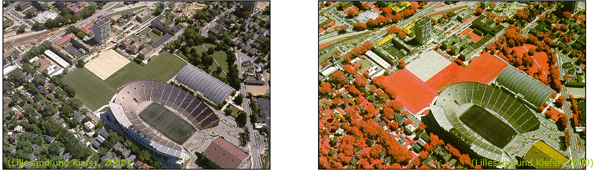


## Basics - What is electromagnetic radiance? What do we measure?

### The nature of electromagnetic energy

* Energy (or light) travels as a periodic electromagnetic field (sinusoidal wave)

* Light travels with – surprise! – **speed of light *(c)* **

* Relevant characteristics are **wavelength *λ* [nm]** and **frequency *ν* [Hz]**

* The wavelength is hence defined according to:  $λ = c / ν$

* In remote sensing, wavelength is the common unit

    + 1 nm (nanometer) =	1 x 10^-9^ m
    
    + 1 µm (micrometer)	=	1 x 10^-6^ m
    
    + 1 mm (millimeter) =	1 x 10^-3^ m
    
* In remote sensing, a target’s spectral properties are measured across a wavelength region and in several or even many distinct bands


### Electromagnetic spectrum

* Spectrometers are sensitive to wavelengths beyond the human eye’s sensitivity

* Optical remote sensing makes use of the visible light (~400 - 700 nm), and the near and short-wave infrared (0,7 - ~3 µm)

* Thermal remote sensing  detects thermal infrared radiation (5 - 15 µm)

* Radar remote sensing detects microwave radiation (1 mm - 1 m)

* Common abbrevations:

    + VIS = visible: 370 - 700 nm
    
    + nIR = near infrared: 0.7 - 1.3 µm
    
    + swIR = short wave infrared: 1.3 - 3 µm
    
    + tIR = thermal infrared: 5 - 15 µm

)](docs/fig/wavelength regions.jpg)

### Measuring surface properties

* Geo- and environmental sciences are primarily interested in processes at the Earth’s surface

* From the interaction between radiation and surface we can draw conclusions on the surface’s characteristics

* Each surface’s interaction with radiation depends on it’s physical and chemical properties and varies with wavelength

* That’s the **basis for the entire remote sensing process**

* To start with: let’s control illumination and ignore the atmosphere

* Let’s assume laboratory conditions (using an artificial light source instead of the sun)


### A laboratory setup

* Lab measurements are performed with a spectrometer and allow an exact characterization of a surface

* We control illumination by using a lamp

* We control the distance and angle to the surface to be measured (usually nadir measurement)

* We control the instrument calibration, i.e. we measure and eliminate the noise from the signal

)](docs/fig/laboratory setup.jpg)

### Measuring target radiance

* In Earth remote sensing, we perform measurements from above, i.e. we are interested in the reflected portion of the energy

* At any surface, incoming radiation is either partially or fully:

    + reflected (ρ)
    
    + absorbed (α)
    
    + transmitted (τ)
    
* The sum of all three terms is always 100% of the incoming radiance: $ρ + α  + τ = 1$ (Law of conservation of energy)

)](docs/fig/light and surface.png)

* The remote sensing sensor measures the reflected portion of the energy in the physical quantity called **radiance**

* The unit of radiance is watts per square meter per steradian: W • m^-2^ • sr^-1^

> *The energy (i.e. electro magnetic radiation [W]) that is reflected (or emitted/transmitted) by a unit of a surface [per m²] into a portion of the hemisphere [per sr]?*

### Excursus - solid angle

* A three-dimensional angle is called **solid angle Ω**

* Definition Ω: the area A cut out from a sphere with the radius r

* Unit: **steradian [sr]**

* Ω = 1 sr if a conus cuts an area A of 1 m^2^ from a sphere with the radius r = 1 m

)](docs/fig/Raumwinkel.png)

### From radiance to reflectance

* The problem with radiance as the unit of measure: it varies with illumination

* Needed: a stable measurement over time, independent of illumination, to avoid introducing changes when measuring unchanged surfaces

* Solution: normalize the measurement relative to the irradiation 

* The ratio between radiance reflected at the Earth’s surface and the incoming radiation is called **reflectance**

  Reflectance = Rad<sub>reflected</sub> / Rad<sub>incoming</sub>

* Reflectance is the percentage of the total measurable radiation, which has not been absorbed or transmitted

)](docs/fig/light and surface.png)

### Diffuse and direct reflectance

* The observation direction influences the measured signal

* In most cases, surfaces reflect the incoming radiation diffusely 

* A special case is **Lambert reflectance** that is often assumed in remote sensing for the sake of simplicity

* Lambert reflectance: the measured signal is independent of the observation direction (no directionality effects in the reflected signal)

* In reality, most surfaces reflect in a mixed way, which can be described by the so called **Bidirectional Reflectance Distribution Function (BRDF)**

* Spectral reference panels (e.g. Spectralon®) are almost Lambert reflectors


## Spectral surface characteristics


### White reference

* In addition to the target surface, a white surface is measured

*This so-called White Reference is a surface with a reflectance of almost 100% across the entire wavelength spectrum 

* Spectralon®, alternatively BaSO<sub>4</sub>

* Reference panels allow measuring the maximum backscatter for a particular point in time and position on Earth

*If a panel reflects 100% across the spectral region of interest, its radiance is the same as the incoming radiance, i.e. it can serve for normalizing the reflectance


### Reflectance

* The ratio between the target radiance measured and the reference panel (white reference) is hence **reflectance**

  reflectance = Rad<sub>target</sub> / Rad<sub>WR</sub>
  
* Reflectance is the percentage of the total measurable radiation, which has not been absorbed (or transmitted)

* Note: The division by Rad<sub>WR</sub> can result in considerable noise in wavelength regions with poor signal-to-noise-ratio


## Reflectance of different surfaces and materials

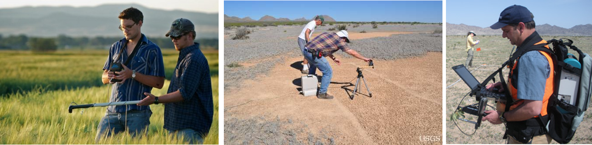

* The object-specific influence determines object-specific patterns in the spectrum of recorded electromagnetic radiation

* The change of irradiation at the Earth’s surface results from material-specific absorption

* We distinguish between absorption features due to electron transitions, molecular vibrations and molecular rotation

* Electron transitions require a high amount of energy > they occur mostly in the VIS

* Vibration and rotation can lead to narrow absorption bands also in the nIR and SWIR

### Reflectance of photosynthetic active vegetation

* Vegetation produces a distinct spectral reflectance pattern due to its leaf and cell structure, its physiognomy, and complex stand structure

* The reflectance of photosynthetically active vegetation is characterized by different factors in the VIS, nIR and SWIR:
    
    + VIS - leaf pigments
    
    + nIR - cell structure
    
    + SWIR - water content
  
* Photosynthetically inactive plant parts differ considerably from active ones across different wavelength regions

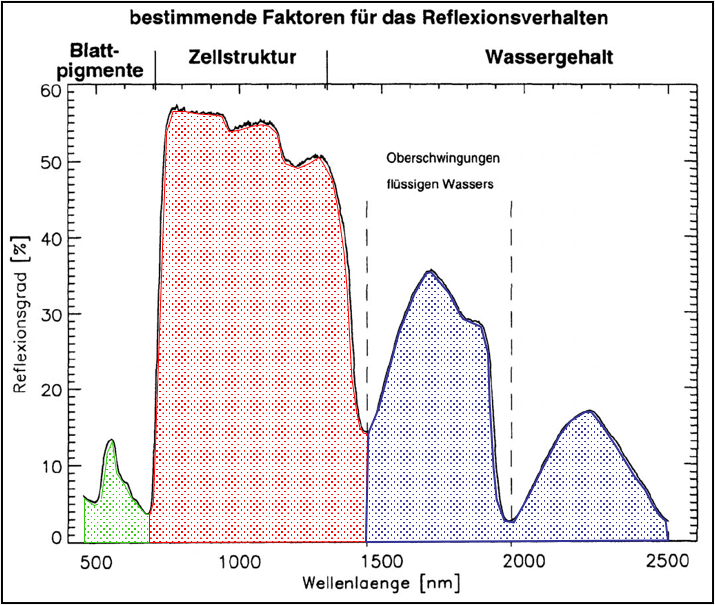

#### Single leaf reflectance

* The reflectance of a single leaf or needle is determined by various absorption, transmission and reflectance characteristics

* Important characteristics are: 

    + The local reflectance maximum in the VIS (green peak) is small
    
    + The high reflectance in the nIR results in the so-called “red edge”
    
    + Thus, transmission in the nIR is very high, in the VIS very small
    
    + Lignin and cellulose, and particularly water, lead to high absorption, especially in the SWIR


#### Plant stress

* According to the factors determining reflectance, there are also three determining damaging factors:

    + Pigments
    
    + Cell structure
    
    + Cell water
    
* Destruction of chlorophyll causes a  flattening of the C<sub>ab</sub>-specific absorption bands

* Destruction of the cell structure causes a shift of the red edge towards the nIR and a flattening of the nIR-plateau 

* Both effects can be detected with remote sensing systems


#### Water stress

* Dehydration of the cell leads to a flattening of absorption bands that depend on water content

* Additionally, albedo increases considerably

* Absorption bands of cellulose and lignin appear more clearly

* Heavy water stress ultimately leads to a destruction of the cell structure and a decrease in plant metabolism


#### Multi-layered leaf reflectance

* The plant’s leaf organs produce complex reflectance patterns

* In the VIS, one leaf layer is enough to absorb almost the entire radiation

* In the nIR, complex radiation paths relate to multiple transmission


* As the degree of transmission varies greatly in different wavelength regions, non-linear changes of the reflectance behaviour occur with an increasing number of leaf layers

* A saturation of the reflectance in the nIR is – depending on the character of the respective leaves or needles – reached with 6 to 7 leaf layers 

* A commonly used measure for the number of leaf layers is the so called 'leaf area index' (LAI), measured in [m^2^ • m^-2^]

#### Plants as a system

* Plants do include photosynthetically inactive parts

* Fruits, spines, flowers, bark, and dead parts of the plant affect the reflectance

* Also structural factors affect the signal

* Aircraft or satellite based methods detect an integral signal

* In remote sensing, the analysis often focuses on the green parts of the plants only


### Reflectance of soils

#### Soil moisture

* Example: silty loam

* Alteration of

    + Form of the reflectance curve
    
    + Albedo

    + Absorption depth

    + FWHM (here: maximum absorption depth, similar to sensitivity function of sensors > compare chapter on spectral resolution)


#### Organic material content

* Figure shows difference between low and very high organic content

* With increasing portion of C<sub>org</sub>

    + The total reflectance decreases
    
    + Particularly the reflectance at 0.6 µm decreases
    
    + The depth of the water-dependent absorption bands decreases


### Reflectance of water

* Water, in its fluid phase, is an excellent absorber (especially in the infrared)

* Clear water reflects less than 5 % in the VIS 

* In the nIR and SWIR, reflectance is close to 0

* Accordingly, water is almost a black body in these wavelength regions

* In its frozen form of ice, and particularly as snow, water is a good reflector


## [USGS spectral characteristics viewer](https://landsat.usgs.gov/spectral-characteristics-viewer)

------

# Optical data (Multi- / Hyperspectral)

## Raster formats in remote sensing

* What you always need to know about your dataset for proper data handling:

    + Spectral resolution (wavelengths, bands)
    
    
    + Spatial resolution (pixel size, GSD), spatial resolution may differ for different bands in the same data set
    
    
    + Rows + columns (height + width)
    
    
    + Radiometric resolution per band (data type)
    

* Band Interleaved by Pixel (BIP): for each band, gray values are stored in a pixel-wise manner on disk

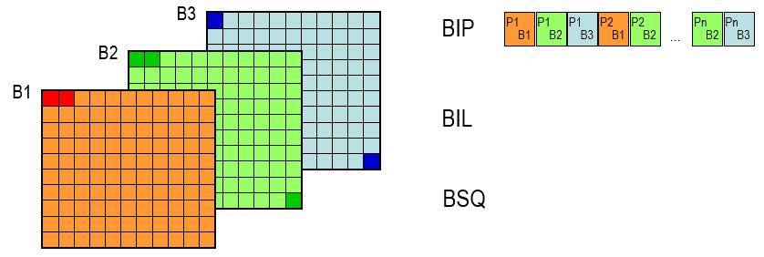

* Band Interleaved by Line (BIL): bands are stored line-wise

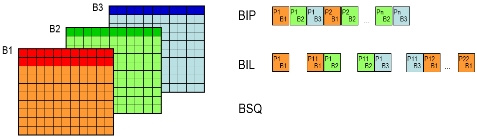

* Band Sequential (BSQ): entire bands are stored on disk one after the other

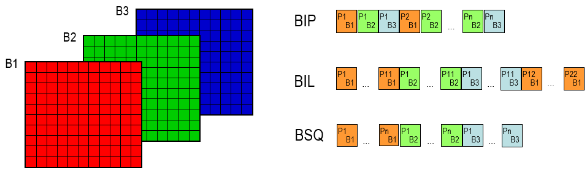

* Metadata or auxiliary data are either stored as part of an integrated data format (in the same file) or as an extra dataset accompanying the image data

* Data types

    + raster values are numbers that are stored in memory
    
    + image size = bands * lines * columns * bit width
    
| Data type | Typical Bit Width | Range |
| :--- | :--- | :--- |
| byte | 1 byte = 8 bit | -127 to 127 (signed); 0 to 255 (unsigned) |
| integer | 2 byte = 16 bit | -32768 to 32768 (signed); 0 to 65535 (unsigned) |
| float | 4 byte = 32 bit | -Inf to +inf, 'single precision'; floating point number according to IEEE 754 |
| double | 8 byte = 64 bit | -Inf to +Inf, 'double precision' |

* File types

    + over 200 raster image formats (see [gdal.org](https://gdal.org/drivers/raster/))
    
    + Most common: ENVI, JPEG2000, GeoTiff
    
| Name | Extension | Description |
| :--- | :---| :---|
| GeoTiff | .tif, .tiff, .gtiff | TIFF + geospatial reference |
| JPEG2000 | .jp2, .j2k | used by many data providers; usually for integer values only |
| ENVI | <None>, .bsq, .bil, .bip, .dat | generic, often used in imaging spectroscopy community; *Header file (.hdr) with meta data!* |
| VRT | .vrt | GDAL Virtual Raster, XML text file |
| HDF4, HDF5 | .hdf, .h4, .hdf4, .h5, .hdf5 | hierarchical data format, version 4 or 5; multi-resolution raster |
| netCDF |  | Network Common Data Forat; multi-resolution raster |
| SAVE |  | Standard Archive Format for Europe e.g. Sentinel-1 and Sentinel-2 |

## Metadata

* Metadata are additional information about the data and are commonly recorded during data acquisition, e.g. Exchangeable Image File Format (EXIF) in standard camera images


* Remote-sensing raster formats usually have their individual way to store metadata

* ENVI format: binary file (.bsq) + header File (.hdr)

  

* GeoTIFF: within .tiff image

* GDAL: (.aux.pam) XML file to supplement existing metadata

  

## HyMap data

### HyMap-sensor: imaging spectrometer

* Airborne hyperspectral sensor

* Line scanner

* Spectral range: 450 - 2500 nm

* 128 spectral channels

* 4 sensor modules á 32 bands

* Geometric resolution: 3 - 10 m (depending on altitude)


## Exercise

### Dataset

* Extract of Berlin-Brandenburg from [Berlin-Urban-Gradient dataset](http://doi.org/10.5880/enmap.2016.002
)

* Urban-land-gradient

* Recorded 20th August 2009

* 111 of 128 spectral channels


### Discussion of data type and structure on the basis of the HyMap image

* Open the header file (metadata) of the HyMap image on O:/ (…/S05/envi_format/HyMap_BB_subset.hdr) in Notepad++

* What do you find out about the following data properties of the image?

    + Dimension in x and y
    
    + Spatial resolution
    
    + Spectral resolution
    
    + Radiometric resolution
    
    + Data type
    
    + Interleave
    
* What additional data properties may be derived from the metadata?

*Upload on Moodle?*

------

# EnMAP Box for QGIS

## Introduction

* Freely available and platform-independent QGIS plugin

* Developed by HU Berlin´s Earth Observation Lab for the hyperspectral satellite sensor EnMAP


## Installation

* [EnMAP-Box Portal](www.enmap.org)

* [Dokumentation](enmap-box.readthedocs.io/en/latest/) 

* [Installation](enmap-box.readthedocs.io/en/latest/usr_section/usr_installation.html)

)](docs/fig/EnMAP installation.png)

## Exercise

### Part 1: Get to know the EnMAP-Box and key features

* Menu structure, opening and portraying images, zoom in and out, selection of bands, contrast stretching


* Visualizing and collecting image spectra, editing of attribute information, colouring of spectra, saving spectral library

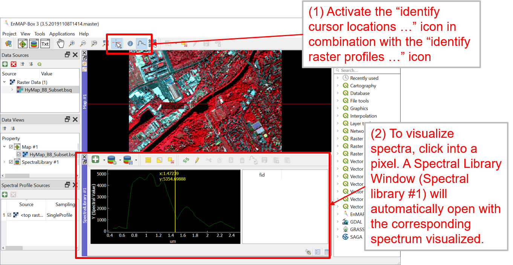


### Part 2: Creating a specral library

* Collect 5 reflectance spectra in the HyMap image (HyMAP_BB_Subset.bsq) for following (pure) materials/surfaces:

    + Building
    
    + Sealed (non built-up)
    
    + Grass
    
    + Tree
    
    + Soil
    
    + Water
    
* Create two attribute columns ('class', 'description') and fill them in. The first serves as an index for the assignment of the six classes (i.e. 'building'), the latter should include a detailed description of the material/surface (i.e. 'red tiles')

* Colour the spectra appropriately with regard to the classes

* Save the collected spectra via the Spectral Library Viewer as a Spectral Library file (SLI)

* Export the image of the coloured spectra as a PNG file and create a PDF file (including a legend)

* **Assignment:** Put the Spectral Library (all files) and the PDF together in a ZIP file and upload the ZIP file on Moodle.

------

# Data Acquisition

## Provider (vielleicht eher 'Sentinel 2'?)

* COPERNICUS program features a pair of optical Earth observing satellites: Sentinel-2A and -2B
Launched in June 2015  (Sentinel-2A), and March 2017 (Sentinel-2B)

* Revisit time 5 days with both satellites, 290km swath width

* Sensor: Multispectral Imager (MSI), 13 spectral bands, partly resembling Landsat

* Spatial resolution of 10 – 60 m, depending on spectral bands, e.g. nIR bands 8 (10m) and 8a (20m).

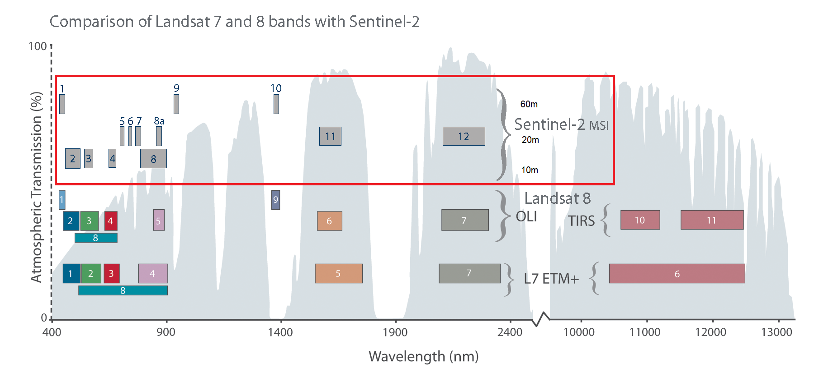

## Sentinel 2
* Sentinel-2 products are delivered in various processing levels. 

   * Level 1B: Top-of-atmosphere radiance values in sensor geometry 

   * Level 1C: Top-of-atmosphere reflectance in cartographic geometry 

   * Level 2A: Bottom-of-atmosphere reflectance in cartographic geometry

* L1C and L2A products are partitioned in “granules”: 100x100 km2 UTM/WGS84 projection


## Acquiring Sentinel-2 Data
* Create a User-Account at the [Copernicus Open Access Hub](https://scihub.copernicus.eu/dhus/#/home)
* Search for images with these specifications: 

  * Date: XXX

  * Sensor: Sentinel-2

  * Producttype: Surface Reflectance (Level 2A, S2MSI2A) 

  * Cloud cover: max. 20%

  * Region: greater area of Berlin

* How many images are available for these specifications?
download this image: 

* Granule: XXX

* Date: XXX

## Pre-Processing
* The downloaded Sentinel-2 image is a .zip-file

* Unzip it and delete the .zip-file

* Take a look at your files


### Visualizing the Sentinel-2 image with 'Virtual Raster Builder' in the EnMAP-Box 
* Goal: the single bands in JPEG2000-format (.jp2) will be merged into a single Multiband-Image in ENVI-format

* Open QGIS and install the 'Virtual Raster Builder' plugin 

* Open the EnMAP-Box and load 'S2_Subset_Berlin.shp' into Data Sources. The shapefile will be used to clip the Sentinel-2 scene to a smaller extend 

* Open 'Virtual Raster Builder' from the EnMAP-Box. Create a Multiband-Image with the following specifications: 
  - Spectral Bands: B2, B3, B4, B5, B6, B7, B8a, B11, B12
  - Spatial Resolution: 20m (from the 'R20M' file)
  - Spatial Extend: according to the shapefile
  - Format: ENVI 

### Create VRT (in den Folien vom Vorjahr soll man ein ENVI erstellen...)

### Amend Metadata
* Visualize the Multiband Sentinel-2 Image in the EnMAP-Box with the band combination R = 8a (nIR), G = 4 (red), B = 3 (green).

* Take a look at the .hdr file. Which metainformation is missing ?

* Delete the edited Sentinel-2 image from the Data Source Panel. Also delete the .aux-file and .vrt-file from apple finder / windows explorer 

* Add the wavelengths of the single bands and the unit for the wavelengths in the .hdr file (metadata). Research the unit and the extend of the applied Sentinel-2 wavelengths.  

* Reload the Sentinel-2 image into the Data Source Panel. The wavelengths should now be displayed on the x-axis when visualizing at image spectra. Now you can compare spectra from different Sensors. 


### Compare S2 & HyMap
part 1 - spatial resolution 

* Visualize the Sentinel-2 image and the HyMap image from last week in a RGB bandcombination that is suited for comparison. In order to do that open the images in two separate MapViews and link them (spatialy + zoom).

* Compare both images visually and describe the effects on image details due to the different spatial resolution (20 m vs. 3.6 m). 

* Choose one surface as example for each of these classes: impervious- built up, impervious- non built up, grass/lawn, trees, soil, water. 

* Take a screenshot from each example. 

### Compare S2 & HyMap
part 2 - spectral resolution

* Restart QGIS and EnMAP-Box. Display the Sentinel-2 image and the HyMap image in a suited RGB band combination. (Wozu ist der Neustart notwendig ?)

* Visualize spectra of the same surface in the Sentinel-2 and in the HyMAP image (9 vs. 111 spectral bands). 

* Try to choose a 'pure' surface (no mixtures) which is also stable in temporal terms (unchanged over time). 

* Do this for the classes mentioned above and add a description and a screenshot. 

* **Assignment:** please upload the comparison (spatial and spectral) of the Sentinel-2 and the HyMap image as pdf to moodle.  

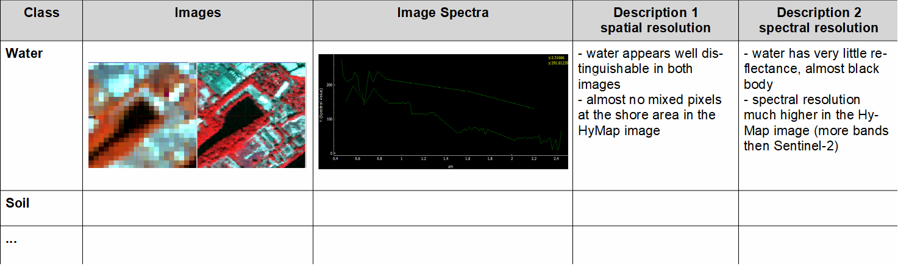 

------

# Vegetation Properties & Spectral Indices


## Normalized Difference Vegetation Index (NDVI)

* The derivation of vegetation indicies or similar variables is based on feature extraction.

* NDVI the one of the most common vegeation indicies.

* It represents the difference between red and nIR reflectance. This difference is strongly prounounced with photosynthetically active vegetation.  (Sollte man wahrscheinlich nochmal umschreiben)

* The NDVI displayes this difference within a normalized value (between -1 and 1) for each pixel.
 
$$NDVI = (ρnIR- ρred) / (ρnIR+ ρred)$$

* e.g. for Sentinel-2 data use reflectance from bands nIR = 865 nm and red = 665 nm for calculating the NDVI.
 
* The calculation of the NDVI results in a singleband grayscale image which can be saved as a new file.  

## Part 1: Calculating the Normalized Difference Vegetation Index (NDVI) for Sentinel-2 data 

* Open the EnMAP-Box and display the Sentinel-2 image (20 m, 9 spectral bands, subset Berlin, DATE: XXX) from last week in a RGB bandcombination of your choice. 

* via 'Applications' start the 'imageMath Calculator' and calculate the NDVI. 

      1. specify the the input image    -> S2_20m = [select Sentinel-2 image]
      
      2. define bands nIR [865 nm] and  -> red    = float32(S2_20m[2])
         red [665 nm] as variable       -> nIR    = float32(S2_20m[6])  
         
      3. provide the NDVI formular      -> NDVI   = (nIR - red)/(nIR + red)
      
      4. specify the output image       -> NDVI   = [filepath and name of the NDVI image]

    
* Run the function and open the singleband grayscale image in a new Map View.

## Part 2: Discussion of the NDVI 

* Take a look at the NDVI-Pixelvalues and create a NDVI image-histogram (Tools 'ImageStatistics') 


* Which value range take pixels in the NDVI image ? 

* Note a representative NDVI value for these surfaces: water, asphalt, decidous forest, open soil. 

* Also, note the corresponding refectance values in the red and nIR band from the original image. How can the values be explained, concerning the spectral properties of the surfaces? 

* Under what cirumstances (relation red to nIR) can NDVI values of 0; 1; -1 be created (in theory)? Please note one pair of values (red and nIR) for each of these NDVI values. 

## part 3: Visualizing of NDVI classes 

* classify the NDVI image through the style menu within the layer properties. Try to display three surfaces: water, impervious/soil and vegetation. 

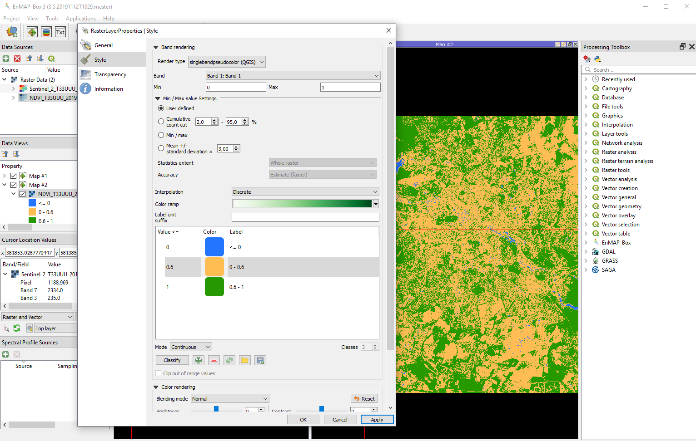

## Assignment part 1: Correlation of NDVI and Imperviousness  

* Open the image 'copernius_imperviousness_2015_berlin.bsq' in a second Map Window and link it to the NDVI image. 

* Inform yourself about the origin of the layer: (https://land.copernicus.eu/pan-european/high-resolution-layers/imperviousness)

* Gather NDVI values of 20 surfaces (zu viele, 10 würden reichen) in a table. Make sure to cover a wide range of values (e.g. -0.2 to 1).

* Create a scatterplot that shows the correlation between NDVI and imperviousness. Use a software of your choice; prefarably R. 

* Describe and discuss the scatterplot in bullet points. 
 
## Assignment part 2: Temporal Variation of the NDVI

* Calculate another NDVI image from the provided Sentinel-2 image taken in winter (date XXX). Use the 'imageMath Calculator'. 

    -> Sentinel_2_T33UUU_20190216_20m_9bands_subset_berlin.bsq  

* Then calculate a difference-image for summer and winter NDVI.

    -> NDVI 27. Juli 2019 – NDVI 16. Februar 2019  DATES: XXX
    
* Compute the histogram of the difference-image and briefly discuss the distribution. 

* Display the difference-image in a suited Visualisation; e.g. discrete classes, colour gradient from high negative to high positive differences. 

* Discuss the resulting Map in bullet points concerning these surfaces: impervious (buildings, and non build-up), agriculture, forest, water. 

* **Assignment:** Please upload the results of the comparison of NDVI and imperviousness (part 1, plot and discussion) and the temporal variation of NDVI (part 2, histogram, map + legend, discussion) as pdf to moodle.

------

# Image Classification part 1: Decision Tree 
  1. Introduction 
  2. Example: Classification of Water 
  3. Exercise 
  
## Introduction to Decision Tree Classification 

* Goal: a landcover map with a Decision Tree. 

* DT is based on 'nodes'/decision-rules to convert **spectral information** (image) into **thematic information** (landcover map).

* Each pixel will be assigned to a class (e.g. Landcover) if its spectral information (or indicies like NDVI) fits certain criteria.

* A Decision Tree is created by hierachically organized binary (yes/no) decisions. 


## Example: Classification of Water

* NDVI <= 0.6 and SWIR <= 2%


## Decision Tree Exercise 

* Open the processed Sentinel-2 image (20m, 9 spectral bands, subset Berlin, DATE XXX) from session 6 in the EnMAP-Box. 

* Classify water bodies vs. land according to the nodes from the example (see slide above). Use the imageMath Calculator. Note that the reflexion values of the image are scaled 0 - 10.000.


## Decision Tree for Landcover of Berlin and Suburbs 

* Open the processed Sentinel-2 image (20m, 9 spectral bands, subset Berlin, DATE XXX) from session 6 in the EnMAP-Box.

* Create a Decision Tree with imageMath Calculator (see examples below) to categorize the these classes:
  + class 1: water bodies
  + class 2: built up 
  + class 3: soil & dry vegetation
  + class 4: coniferous forest 
  + class 5: deciduous forest & lawns


* Discuss the resulting classification critically and list pros and cons of the method and the nodes used respectively.

* **Assignment:** Please upload a screenshot of your imageMath script, the classification (map + legend) and the discussion as .pdf to moodle. 

 


------

# Image Classification part 2: Random Forest
1. Random Forest Classifier
2. Variability and Separability of Thematic Classes
3. Random Forest Classification of the Greater Berlin Area 

## 1. Random Forest Classifier
* Random Forest classification is a supervised classification approach based on self-learning decision trees.


## 1. Random Forest Classifier 
* Random Forest classification relies on an ensemble of self-learning decision trees, where each decision tree is randomized.

* Class assignment of each image pixel is based on a majority vote.


## 2. Variability and separability of thematic classes
* **Thematic classes** often consist of multiple **spectral classes** (cluster of several surfaces which have similar spectral properties).

* It is essential to consider all spectral classes, meaning all characteristics of a thematic class, when generating training data for the Random Forest Classification.

* Depending on the number of spectral classes, a thematic class can have higher or lower **within-class variability**.


* If spectral classes of the thematic classes are organized in separable clusters, the **separability** of the thematic classes is high. 

* If spectral classes overlap, the separability of the thematic classes will decrease or they even may be unseparable. 

* Depending on the separability of the thematic classes, the **between-class similarity** will be higher or lower.

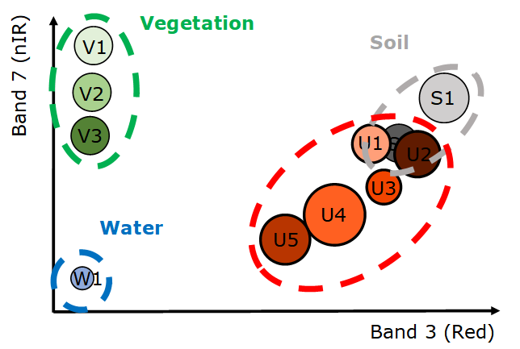

## 3. Random Forest Classification of the Greater Berlin Area 
* Goal: landcover classification map of the Greater Berlin Area with Random Forest classification.

* Use the Random Forest to classify the processed Sentinel-2 image (20m, 9 spectral bands, subset Berlin, DATE XXX) from session 6 into these Landcover classes: 
  + class 1: Urban (impervious built-up and non built-up)
  + class 2: Grass & Crops
  + class 3: Deciduous Forest 
  + class 4: Coniferous forest 
  + class 5: Soil (including agricultural cropland)
  + class 6: Water

* Afterwards the Quality of the Map (validation) shall be evaluated with an Accuracy Assessment.

## Random Forest Classification of the Greater Berlin Area 
* Part 1 - Gathering a Trainingdata-Set in QGIS
* Part 2 - Random Forest Classification in the EnMAP-Box
* Part 3 - Revision of the Classification
* Part 4 - Validation of the output in the EnMAP-Box (next session)

### Part 1 - Gathering a Trainingdata-Set in QGIS 
* Visualize the Sentinel-2 image in QGIS 

* Generate a point-shapefile (file name: "training_data.shp", Geometry Type: Point, CRS: EPSG 32633) with two attribute columns:
"lc_id" type: integer and "lc_class" type: text data.

* Collect 20 representative training points per class. Consider these criteria: spatially evenly distributed, each training point belongs to one class only, within each thematic class cover all spectral classes. 

* Type in a unique class id and the name for each class in the attribute table:

|lc_id|lc_class|
| :--- | :--- |
|1|urban|
|...|...|
|2|grass_crops|
|...|...|
|3|deciduous|
|...|...|

* Tips: 
  * use suited pseudo color visualizations (e.g. nir-swir1-red, or nir-red-blue)
  * use QuickMapServies with high resolution images as help 
  * use 'Identify Features' function in QGIS to see spectral signatures 
  * name your classes consistently 
  * save your progress regulary in the attribute table

### Part 2 - Random Forest Classification in the EnMAP-Box 

* Start the EnMAP-Box and load the Sentinel-2 image and the "training_data.shp" shapefile into the Data Source Panel. 

* Open the 'Classification Workflow' via 'Applictions' and specify: 
 
  + Training Inputs- Raster: Sentinel-2 image
  + Training Inputs- Reference: shapefile with trainingpoints
  + Attribute: Column with numeric class ID  
  + Sampling: Class name and colors  
  + Mapping- Input Raster: Sentinel-2 image 
  + Mapping- Outputs: activate Classification and specify file path and file name of the resulting classification map 
  
* Leave everything else to default setting for now. 

* Run the Random Forest and open the resulting landcover classification in a second Map View.

### Part 3 - Revision of the Classification
* Please assess the quality of the resulting landcover map and indentify which classes respectively which areas were unsufficiently/incorretly classified (e.g. separation of "urban" and "soil").

* Gather further trainingpoints for the problematic classes. Consider to include mixed pixels that are dominated by impervious surfaces (> 50%) into the "urban" class. 

* Repeat the Random Forest Classification with the new trainingpoints until you reach a satisfying result.

* In 4-6 bullet points explain the procedure and the respective effect of the repeated generation of training data. 

* Discuss the result of the final classification in 4-6 bullet points. 

* **Assignment:** Please upload the final classification (map incl. legend) and the discussion as .pdf in moodle. 

------

# Accuracy assessment

------

# Sentinel-2 time series

------

# MODIS time series

------

# Case studies: Change detection

------

