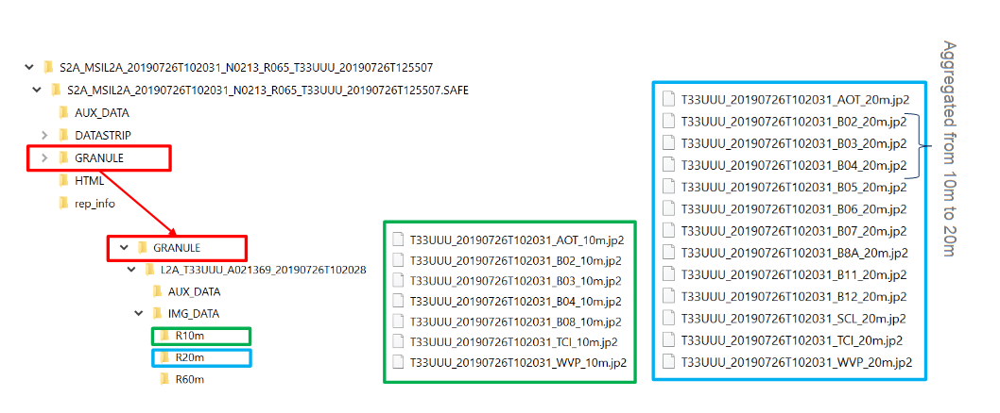

 

```{r knitr_init, echo=FALSE, cache=FALSE, message=FALSE, include=FALSE}
library(knitr)
library(rmdformats)
library(shiny)

## Global options
options(max.print='75')
opts_chunk$set(echo=FALSE,
	             cache=TRUE,
               prompt=FALSE,
               tidy=FALSE,
               comment=NA,
               message=FALSE,
               warning=FALSE, 
               use_bookdown = TRUE)
opts_knit$set(width=75)
```

# Welcome!


## About

Introduction to Remote Sensing is an introductory remote sensing course for Geography students at Humboldt-Universität zu Berlin. In this course, you will be exposed to theoretical fundaments and introductory applications of remote sensing. The course is based on open source software.

------

## Requirements 

------

## Learning goals & course contents

------

# Course materials

## Software 

We use openly available and platform independent (Windows, Linux, Mac OS) software packages throughout this course. Please install the latest versions of: 

* [R v3.6.X](https://www.r-project.org/)
* [R studio v1.2.X](https://rstudio.com/products/rstudio/)
* [QGIS v3.1X.X](https://www.qgis.org/)


------

## Data

------

## Assignments

The weekly assignments are defined in the respective session. Each session comprises several tasks that involve scipting in R. Course participants must submit completed assignments, documented as R scripts, in [moodle](http://moodle.hu-berlin.de/) to pass. Weekly submission deadlines are monday, 23:59. Please name the script of your work group as SXX_name1_name2.R. Please structure your script for every assignment as follows:

------

# Visual image interpretation

 


## Image interpretation

* Open Google Earth

* Deactivate the oblique view (use key "R")

* Disable multimedia (e.g. pictures)

* Move to two different positions in Berlin and answer the following questions with help of the aerial photographs:

    + Which season was the flight operated in?

    + Is it possible to get the exact month and/or day?

    + What was the day of the week?

    + What was the time of day?

## Digitizing

* Navigate to Campus Adlershof

* Right-click on 'Meine Orte' and create a new folder called 'FE1'

* Use the digitizing tools (see image below) to...

    + Mark the wind tunnel as a point
    
    + Digitize a section of the S-Bahn trail as a line
    
    + Save the Institute of Geography as a polygon (semitransparent and outlined)
    
* The results of the digitization need to be located in the 'FE1' folder

* Save the folder 'FE1' with a right-click on the folder as a .kmz file on O:/...

    


## Observing change

note: add digitizing tools img in section digitizing, add img 2009 and 2019 in the beginning

## Exercise


------

# On-screen visualization

## Additive color model

## Image histogram

## Contrast stretch

## Exercise

------

# Land cover / land use classification

## Mapping the Earth surface

## Land cover or land use? 

## Visual image interpretation

## Land use / cover area frame survey (LUCAS)

## Exercise

------

# Lab and field spectroscopy

## [USGS spectral characteristics viewer](https://landsat.usgs.gov/spectral-characteristics-viewer)

## 

------

# Optical data (Multi- / Hyperspectral)

## Raster formats

## Metadata

## HyMap data

------

# EnMAP Box for QGIS

## Introduction

## Installation

## Key features

## Demo

------

# Data acquisition

## Provider (vielleicht eher 'Sentinel 2'?)

* COPERNICUS program features a pair of optical Earth observing satellites: Sentinel-2A and -2B
Launched in June 2015  (Sentinel-2A), and March 2017 (Sentinel-2B)

* Revisit time 5 days with both satellites, 290km swath width

* Sensor: Multispectral Imager (MSI), 13 spectral bands, partly resembling Landsat

* Spatial resolution of 10 – 60 m, depending on spectral bands, e.g. nIR bands 8 (10m) and 8a (20m).


## Sentinel 2
* Sentinel-2 products are delivered in various processing levels. 

   * Level 1B: Top-of-atmosphere radiance values in sensor geometry 

   * Level 1C: Top-of-atmosphere reflectance in cartographic geometry 

   * Level 2A: Bottom-of-atmosphere reflectance in cartographic geometry

* L1C and L2A products are partitioned in “granules”: 100x100 km2 UTM/WGS84 projection


## Acquiring Sentinel-2 data
* Create a User-Account at the [Copernicus Open Access Hub](https://scihub.copernicus.eu/dhus/#/home)
* Search for images with these specifications: 


      Date: XXX

      Sensor: Sentinel-2

      Producttype: Surface Reflectance (Level 2A, S2MSI2A) 

      Cloud cover: max. 20%

      Region: greater area of Berlin

* How many images are available for these specifications?
download this image: 

Granule: XXX

Date: XXX

## Pre-processing
* The downloaded Sentinel-2 image is a .zip-file

* Unzip it and delete the .zip-file

* Take a look at your files



### Visualizing the Sentinel-2 image with 'Virtual Raster Builder' in the EnMAP-Box 
* Goal: the single bands in JPEG2000-format (.jp2) will be merged into a single Multiband-Image in ENVI-format

* Open QGIS and install the 'Virtual Raster Builder' plugin 

* Open the EnMAP-Box and load 'S2_Subset_Berlin.shp' into Data Sources. The shapefile will be used to clip the Sentinel-2 scene to a smaller extend 

* Open 'Virtual Raster Builder' from the EnMAP-Box. Create a Multiband-Image with the following specifications: 
  - Spectral Bands: B2, B3, B4, B5, B6, B7, B8a, B11, B12
  - Spatial Resolution: 20m (from the 'R20M' file)
  - Spatial Extend: according to the shapefile
  - Format: ENVI 

### Create VRT (in den Folien vom Vorjahr soll man ein ENVI erstellen...)

### Amend metadata
* Visualize the Multiband Sentinel-2 Image in the EnMAP-Box with the band combination R = 8a (nIR), G = 4 (red), B = 3 (green).

* Take a look at the .hdr file. Which metainformation is missing ?

* Delete the edited Sentinel-2 image from the Data Source Panel. Also delete the .aux-file and .vrt-file from apple finder / windows explorer 

* Add the wavelengths of the single bands and the unit for the wavelengths in the .hdr file (metadata). Research the unit and the extend of the applied Sentinel-2 wavelengths.  

* Reload the Sentinel-2 image into the Data Source Panel. The wavelengths should now be displayed on the x-axis when visualizing at image spectra. Now you can compare spectra from different Sensors. 


### Compare S2 & HyMap
part 1 - spatial resolution 

* Visualize the Sentinel-2 image and the HyMap image from last week in a RGB bandcombination that is suited for comparison. In order to do that open the images in two separate MapViews and link them (spatialy + zoom)

* Compare both images visually and describe the effects on image details due to the different spatial resolution (20 m vs. 3.6 m). 

* Choose one surface as example for each of these classes: impervious- build up, impervious- not build up, grass/lawn, trees, soil, water. 

* Take a screenshot from each example. 

### Compare S2 & HyMap
part 2 - spectral resolution

* Restart QGIS and EnMAP-Box. Visualize the Sentinel-2 image and the HyMap image in a suited RGB band combination (Wozu ist der Neustart notwendig ?)

* Visualize spectra of the same surface in the Sentinel-2 and in the HyMAP image (9 vs. 111 spectral bands). 

* Try to choose a 'pure' surface (no mixtures) which is also stable in temporal terms (unchanged over time). 

* Do this for the classes mentioned above and add a description and a screenshot. 


------

# Vegetation properties & spectral indices

------

# Image classification

------

# Random forest

------

# Accuracy assessment

------

# Sentinel-2 time series

------

# MODIS time series

------

# Case studies: Change detection

------

